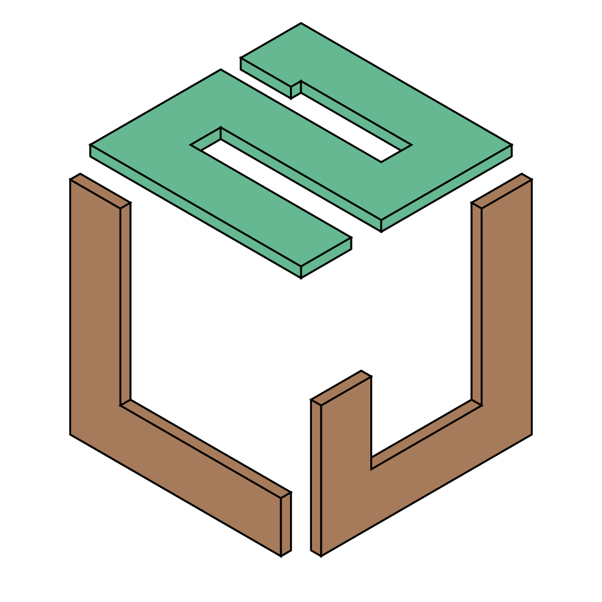
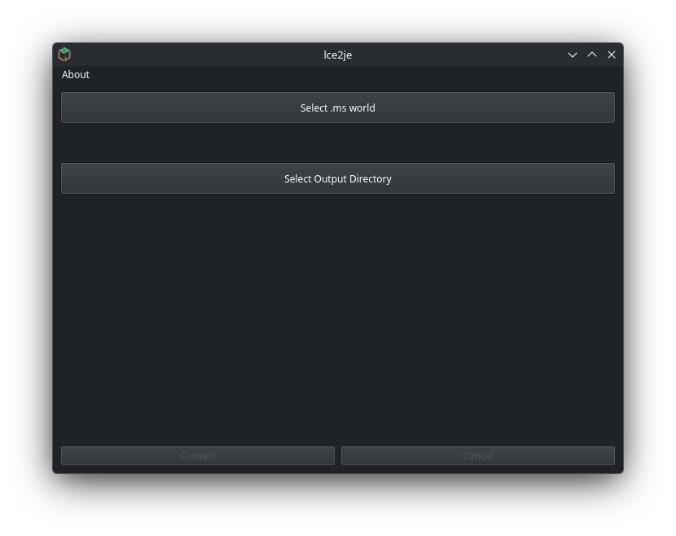
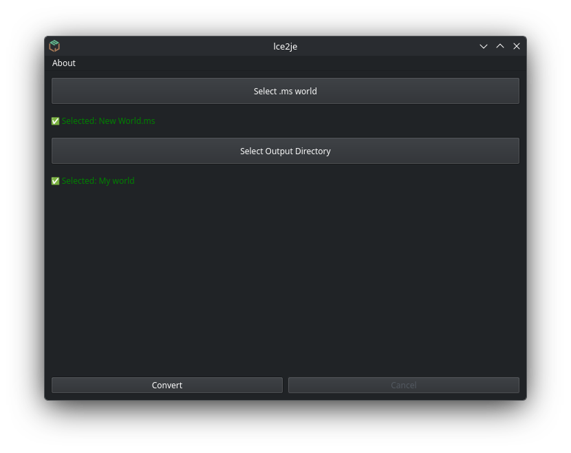
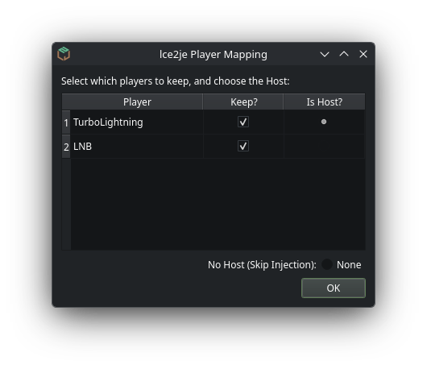
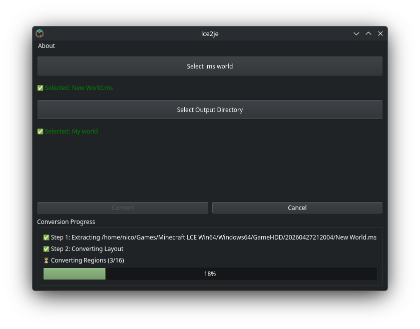
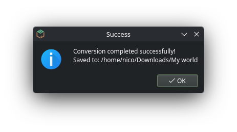

# lce2je - Minecraft LCE (Windows64) to Java World Converter

<div align="center">
  
</div>

This repository contains tools to convert Minecraft Legacy Console Edition (LCE Windows64) `.ms` world saves to standard Minecraft Java Edition 1.6.4 saves. 

It is specifically designed for the leaked Windows64 build of Legacy Console Edition, providing an interactive, cross-platform Graphical User Interface (GUI) to handle complex proprietary data structures, region chunk translation, and networking profile conversions seamlessly.

## Downloads

You can download the standalone, portable executables for your operating system from the [Releases](https://github.com/nicodotgit/lce2je/releases) page. 

- **Windows**: Download `lce2je.exe`
- **Linux**: Download `lce2je.AppImage`

> **Note for Windows Users**: The standalone `.exe` is unsigned by default. Because of this, Windows SmartScreen and some Antivirus software may flag it. To run it, you may need to click **More Info -> Run Anyway**.

## Usage

lce2je provides a fully interactive GUI that guides you through the conversion process safely and cleanly.

### 1. Select the World
Locate your Legacy Console Edition world `.ms` file to import it.
You'll have to select an Output Directory for your converted World too.
<div align="center">
  
  <br>
  <br>
  
</div>

### 2. Map Player Data
Because Legacy Console Edition uses random numeric IDs for player data (unlike Java Edition 1.6.4 which stores the host inside `level.dat`), the converter will automatically scan the world and prompt you to select which player profile should become the local Java Edition host. You should select a host only if you're planning to play this converted world as a Singleplayer or LAN world.
<div align="center">
  <br>
  
  <br>
</div>

### 3. Conversion
The tool will automatically extract the proprietary `.ms` archive, convert the binary chunk formats, translate the NBT structures, and safely reconstruct the world into a standard Java Edition 1.6.4 folder format.
<div align="center">
  <br>
  
  <br>
</div>

### 4. Finished!
Once completed, you'll be greeted with a success dialog and the output folder will automatically open, ready to be copied directly into your `.minecraft/saves` directory or wherever you want!
<div align="center">
  <br>
    
</div>

## Features

- **Graphical User Interface**: A clean, responsive GUI that makes complex technical conversions accessible to everyone.
- **Standalone Portability**: Pre-compiled binaries for Windows and Linux mean you don't need to install Python or any dependencies to use the converter. 
- **Automated Deployments**: Integrated CI/CD workflows automatically compile and deploy new versions and binaries directly to the GitHub Releases tab.
- **Auto-Open Output**: Seamlessly boots your native file explorer directly to the newly converted world.
- **Bidirectional Support**: While the main GUI focuses on `LCE -> Java Edition`, the repository also maintains the original command-line scripts (`je2lce_main.py`) to convert Java Edition 1.6.4 worlds *back* into LCE format.
- **Modern DataFixer Compatibility**: The pipeline recursively scrubs and sanitizes all proprietary LCE string UUIDs from chunk entities and player data, rebuilding standard native Java Edition UUID integers to prevent crashes when upgrading the converted world to modern Minecraft versions.
- **Atomic File Generation**: All converted chunks and metadata files are safely isolated using `.tmp` extensions until fully written. Power outages or hard interruptions will never corrupt your files.

## LCE `.ms` File Format Technical Breakdown

The `saveData.ms` file is a custom archive format designed for this specific edition. Here is how it is structured:

### 1. Archive Wrapper
The outer wrapper of the `.ms` file is Zlib-compressed, but typically includes an 8-byte uncompressed header:
- **Bytes 0-3**: Padding/Reserved (`0x00000000`)
- **Bytes 4-7**: Decompressed size in bytes (Little-Endian Uint32)
- **Bytes 8+**: Standard Zlib stream (starting with `0x78 0x9C` or similar) containing the filesystem.

### 2. Uncompressed Archive Payload
Once decompressed, the file is a flat binary blob containing internal files and a File Allocation Table (FAT) located near the end of the file.
- **Bytes 0-3**: File Allocation Table Offset (Little-Endian Uint32). This points to the absolute offset in the uncompressed data where the directory records start.
- **Bytes 4-11**: An 8-byte global payload header `[Num_FAT_Records] + [09 00 09 00]` denoting the number of packed files and the global architecture save version.
- **Bytes 12 to (FAT Offset - 1)**: Raw concatenated binary data for all the internal files (Level metadata, region files, player data, etc.).
- **Bytes (FAT Offset) to EOF**: The directory FAT.

### 3. File Allocation Table (FAT)
The FAT consists of continuous `144-byte` records. Each record describes one internal file:
- **Bytes 0-127**: A UTF-16LE null-terminated string representing the file path (e.g., `level.dat`, `DIM-1r.0.0.mcr`).
- **Bytes 128-131**: File size in bytes (Little-Endian Uint32).
- **Bytes 132-135**: File content offset in bytes from the start of the uncompressed archive (Little-Endian Uint32).
- **Bytes 136-143**: 8 bytes of internal timestamps (Little Endian 32-bit UNIX timestamp).

The list concludes immediately after the last record. LCE engine do *not* use a terminating null record; it iterates strictly up to the uncompressed data threshold.

### 4. Level and Player Data Configuration
Because `.ms` files are themselves wrapped in Zlib compression, LCE does not store `level.dat` and `players/*.dat` files using standard GZip compression. In order for standard Java Edition builds to recognize and list these worlds, they must be locally compressed using GZip upon extraction. Conversely, when converting back to LCE, they must be cleanly uncompressed.

Furthermore, Java Edition worlds are infinite and lack proprietary metadata bounding boxes inside `level.dat`. When converting Java Edition worlds back to LCE, the converter programmatically injects default values for 15 proprietary LCE engine keys (e.g., `XZSize`, `ClassicMoat`) to prevent the engine from fatally crashing upon load.

### 5. Region File Differences (.mcr)
LCE `.mcr` Region Files look deceptively similar to Java Edition McRegion/Anvil files, but contain dramatic structural differences requiring bit-level rewriting to port:
- **Chunk Headers Endianness:** Java Edition stores standard region chunk offsets with 3 bytes of offset followed by 1 byte of size in **Big-Endian**. LCE inverses and modifies this, using 1 byte for size followed by 3 bytes for offset in **Little-Endian**.
- **Payload Lengths:** Upon reaching the offset location, Java Edition reads a 4-byte chunk size in Big-Endian. LCE reads a 4-byte chunk size in Little-Endian.
- **Chunk Payload Structure:** LCE chunks do not use native string-based NBT key mappings. The decompressed Zlib payload is further obfuscated by an RLE-encoding layer. Once fully decompressed, the chunk is an engineered C++ binary struct containing:
  1. A binary header with version (8 or 9), coordinates, and timestamps.
  2. `CompressedTileStorage`: Two 128-height block ID structures using complex bit-packed palettes mapped via 3D Z-order curves.
  3. `SparseNibbleStorage`: Four 128-height data arrays (Data, SkyLight, BlockLight) utilizing plane indices and 4-bit packed nibbles.
  4. Flat 256-byte arrays for HeightMaps and Biomes.
  5. A standard Java Edition NBT tag appended at the very end to store dynamic `Entities` and `TileEntities`.
- **Metadata Extraction Mathematics:** To successfully parse LCE `SparseNibbleStorage` back into JE's 256-height flat format without corrupting block states (e.g. wool colors, stair facings), the data must be read using the 1D index `pos = (xz << 8) | y`. When reversing the process (Java Edition to LCE), the converter shifts bitwise indexes utilizing `(xz << 7) | y` and dynamically applies LCE header-flag compression protocols to seamlessly trim empty homogenous arrays.

### 6. Player Data Quirks & Network UIDs
Java Edition 1.6.4 Singleplayer explicitly stores the host player's inventory and location inside `level.dat` under a native `Player` tag. Legacy Console Edition completely abandons this format, splitting *all* players (including the host) into the `players/` directory using numerical account IDs (e.g., `16141134514358595374.dat`).

**UID Generation:**
The numerical IDs used by the LCE engine are **100% randomly generated** 64-bit Hexadecimal integers assigned to your profile on its very first launch, and permanently cached in a local `uid.dat` file. However, if the game's offline Xbox Live spoofing wrapper fails to initialize correctly when you host a local server, the engine panics and falls back to a hardcoded 4J Studios Developer UID: `16141134514358595374` (`0xE000D45248242F2E`). Because of this, the local Host in the Windows LCE port will *always* use this static Developer UID.

**The Solution:**
While LCE uses arbitrary numeric filenames, it hides the player's true username internally within the `.dat` file inside a standard `UUID` NBT String tag. 
- **LCE to Java Edition:** The converter automatically reads these internal `UUID` tags to populate an interactive menu, allowing you to select which player should become the Java Edition Singleplayer Host. It safely injects their data into `level.dat` and automatically renames the remaining numeric files to match their usernames for flawless LAN multiplayer compatibility.
- **Java Edition to LCE:** The converter scans the Java Edition world for players and interactively asks you to assign them as the LCE Win64 Host (automatically receiving the static `16141134514358595374` UID) or prompts you to input the randomly generated UIDs of your joining friends.


## Command-Line Scripts & Advanced Usage

If you prefer to manage the environment yourself or wish to convert Java Edition worlds back to LCE (`je2lce`), install the dependencies from `requirements.txt` and run the master Python entry points:

**LCE to Java Edition:**
```bash
python lce2je_main.py <path_to_saveData.ms> <output_directory>
```

**Java Edition to LCE:**
```bash
python je2lce_main.py <path_to_java_world> <output_saveData.ms>
```


1. `scripts/extract_ms.py` / `scripts/pack_ms.py` - Unpacks/Packs the `.ms` file into raw LCE files via Zlib/FAT decoding.
2. `scripts/lce_to_java.py` / `scripts/java_to_lce.py` - Translates directory structures, applies GZip/Un-GZip conversions, and programmatically injects proprietary bounding boxes.
3. `scripts/convert_chunks.py` / `scripts/convert_chunks_reverse.py` - Deeply parses/compiles LCE `.mcr` binary structs and translates them seamlessly into standard Anvil NBT `.mca` files.
4. `scripts/inject_player.py` / `scripts/extract_player.py` - Reads and safely maps NBT `Player` arrays between Java Edition `level.dat` bounds and LCE numerical `players/*.dat` network equivalents.
5. `scripts/progress.py` - Centralized state manager handling `lce2je_progress.json`. Manages atomic file `.tmp` cleanup, ensures strict resume tracking, and handles safe interactive `Ctrl+C` interruption.

**lce2je and each of its components are not official Minecraft products and are not endorsed by Mojang.**

This software is licensed under the GNU General Public License v3.0 (GPLv3). Please see the `LICENSE` file for more details.

THE SOFTWARE IS PROVIDED "AS IS," WITHOUT WARRANTY OF ANY KIND, EXPRESS OR IMPLIED, INCLUDING BUT NOT LIMITED TO THE WARRANTIES OF MERCHANTABILITY, FITNESS FOR A PARTICULAR PURPOSE, AND NONINFRINGEMENT. IN NO EVENT SHALL THE AUTHORS OR COPYRIGHT HOLDERS BE LIABLE FOR ANY CLAIM, DAMAGES, OR OTHER LIABILITY, WHETHER IN AN ACTION OF CONTRACT, TORT, OR OTHERWISE, ARISING FROM, OUT OF, OR IN CONNECTION WITH THE SOFTWARE OR THE USE OR OTHER DEALINGS IN THE SOFTWARE.

"Minecraft" is a registered trademark of Mojang Synergies AB and is not affiliated with this software.

Oracle, Java, and MySQL are registered trademarks of Oracle and/or its affiliates. Other names may be trademarks of their respective owners.

This repository or its owner does not own or store any Mojang Synergies AB products, and the availability of these products is not dependent on him or this repository.

This repository or its owner does not own or store any Oracle products, and the availability of these products is not dependent on him or this repository.

All Mojang Synergies AB-related elements and names are used in compliance with the [Minecraft Commercial Usage Guidelines](https://www.minecraft.net/en-us/eula/) and [Brand and Asset Usage Guidelines](https://account.mojang.com/terms?ref=ft#brand).

All Oracle-related elements and names are used in compliance with the [Oracle Terms of Use](https://www.oracle.com/legal/terms.html) and [Trademarks](https://www.oracle.com/legal/trademarks.html).
